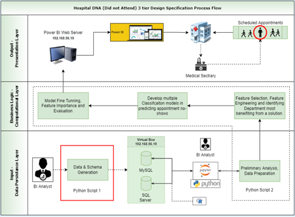
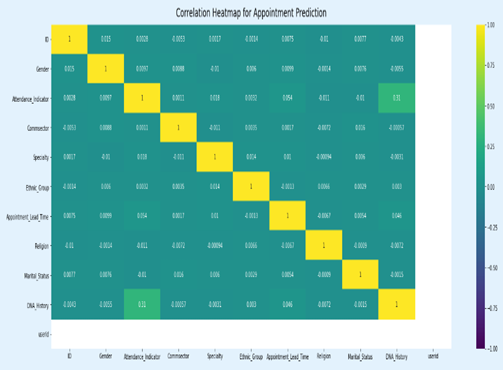
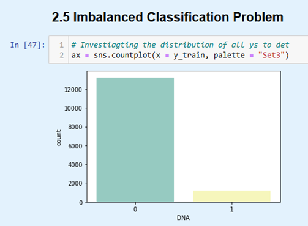
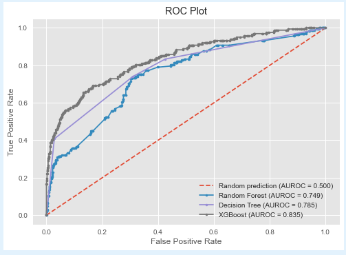
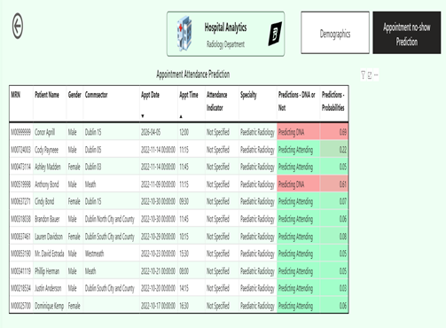

# Predictive Analytics – Missed Appointment Prediction

## Project Overview

This project developed a machine learning model to predict the likelihood of patients missing scheduled hospital appointments. The goal was to support healthcare services in identifying high-risk appointments and improving scheduling efficiency.

## Objectives

- Predict missed appointments using historical appointment data
- Identify key factors associated with non-attendance
- Build and compare multiple machine learning models
- Deploy results into a reporting dashboard

## Dataset

The dataset included:

- Patient demographics
- Appointment details
- Attendance history
- Lead time between booking and appointment
- Appointment location
- Appointment type

## Project Workflow

1. Data Extraction (SQL + Python)
2. Data Cleaning
3. Exploratory Data Analysis
4. Feature Engineering
5. Model Development
6. Model Evaluation
7. Deployment to Power BI Dashboard

## Models Used

- Logistic Regression
- Decision Tree
- Random Forest
- XGBoost

## Model Evaluation Metrics

- Accuracy
- Precision
- Recall
- ROC-AUC

## Results

The Random Forest model produced the best performance:

- **Accuracy:** 82%
- **ROC-AUC:** 0.87
- **Recall for missed appointments:** 71%

## Key Predictors

Top factors influencing missed appointments:

- Lead time (days between booking and appointment)
- Age group
- Previous missed appointments
- Appointment location
- Day of week

## Dashboard & Visualisations

| Model Performance               | Feature Importance              |
| ------------------------------- | ------------------------------- |
|  |  |

| Missed Appointment Analysis     | Lead Time Analysis              |
| ------------------------------- | ------------------------------- |
|  |  |

### Dashboard Overview

## Tools Used

- Python
- SQL
- Scikit-learn
- Pandas
- Matplotlib / Seaborn
- Power BI

## Project Outcome

This project demonstrates how predictive analytics can be used in healthcare to reduce missed appointments, improve resource planning, and support data-driven decision-making.

## Author

**Blain Tech**
